# Ansh Air Cool Billing & Service Management

A Windows desktop app for small AC service shops: customers, invoices, AMC contracts, technicians, inventory and daily service logs in one place. It is built by [Akash Vishwakarma](https://github.com/AKASH991833) and used for a real AC service business, Ansh Air Cool.

**Zero setup:** the app uses a local SQLite database. There is no server to install and no configuration needed. Install it, open it, and start billing. All data stays on the owner's machine.

## Features

**Billing and invoices**
- PDF invoices with shop branding and a UPI QR code
- Pro-forma invoices (estimates) before final billing
- GST-aware totals; GST can be left off for non-GST shops
- Payment tracking: advances, partial payments, balance due

**Customers**
- Customer ledger with full service and payment history
- AMC (Annual Maintenance Contract) module with renewal tracking
- Daily service log: each visit, work done, parts used, payment received

**Inventory and technicians**
- Spare-part stock with low-stock alerts
- Parts issued per technician and per job
- Technician assignment and settlement view

**Sharing and reports**
- Share an invoice or a payment reminder through WhatsApp (opens the chat via a wa.me / WhatsApp Desktop link; you press send)
- Invoice email dialog (SMTP, configured by the owner)
- Dashboard with revenue, pending payments and AMC status
- Export reports to Excel and PDF
- Audit log of key actions

## Screenshots

Screenshots use a demo database with fake customers (`python scripts/seed_demo_data.py`, `python scripts/capture_screenshots.py`).

### Dashboard
Revenue, pending payments and AMC status at a glance.

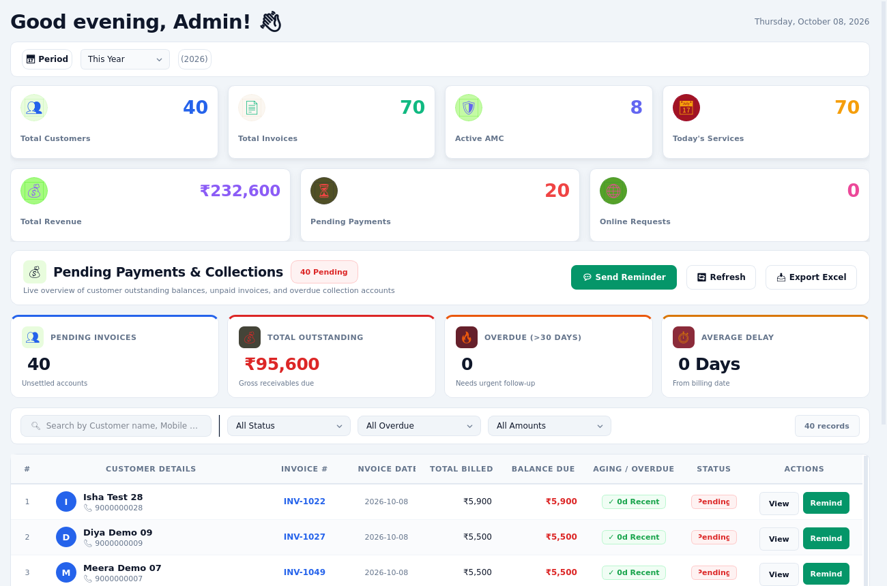

### New invoice
Pick a customer, add services and parts, GST and discount handled.

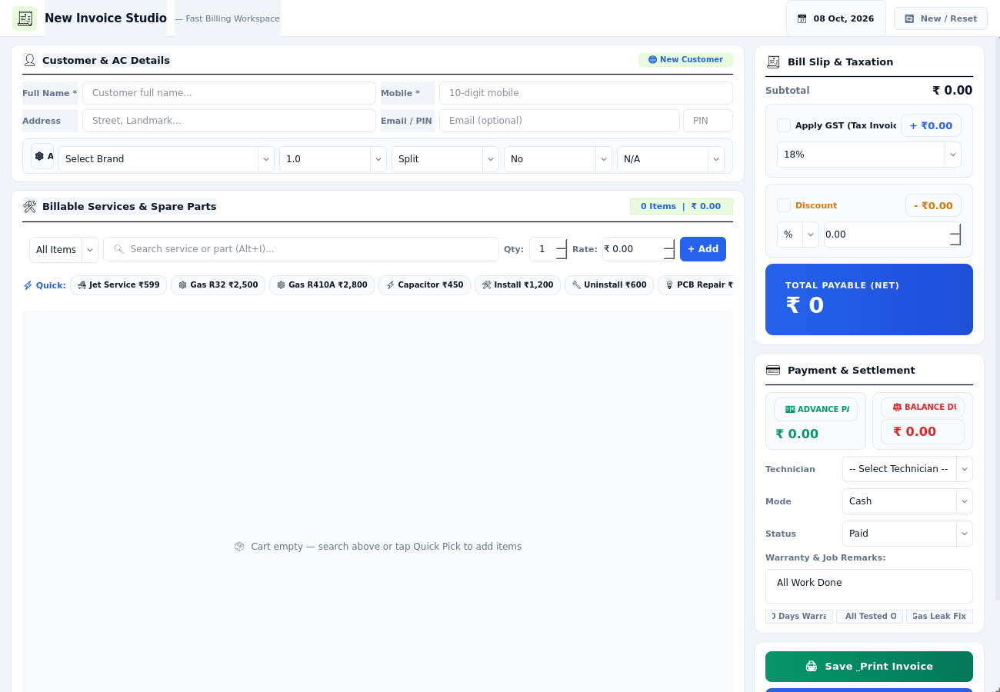

### Invoices
Searchable invoice list with payment status.

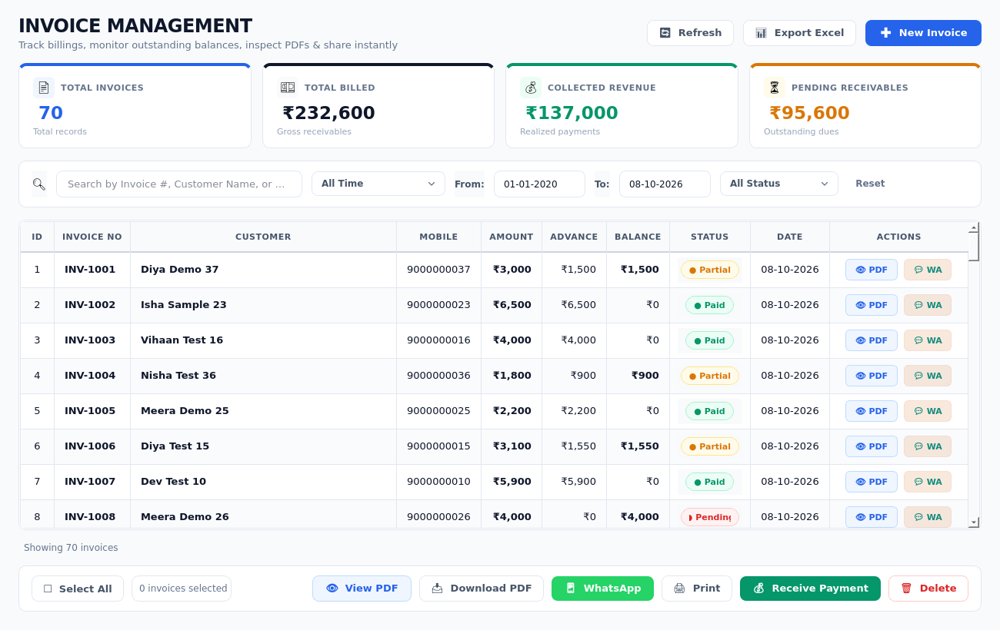

### Invoice PDF
Printable A4 invoice with a UPI QR (demo data, placeholder QR).

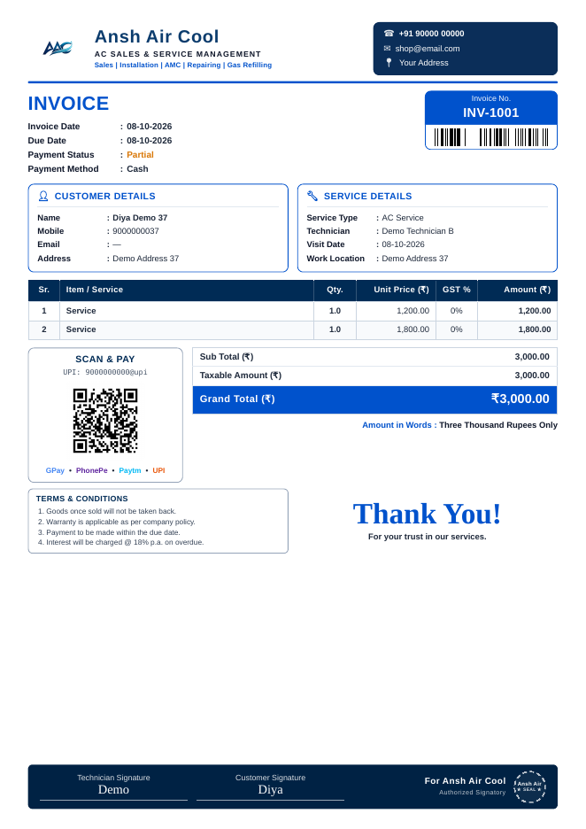

### Customers
Customer records with service history.

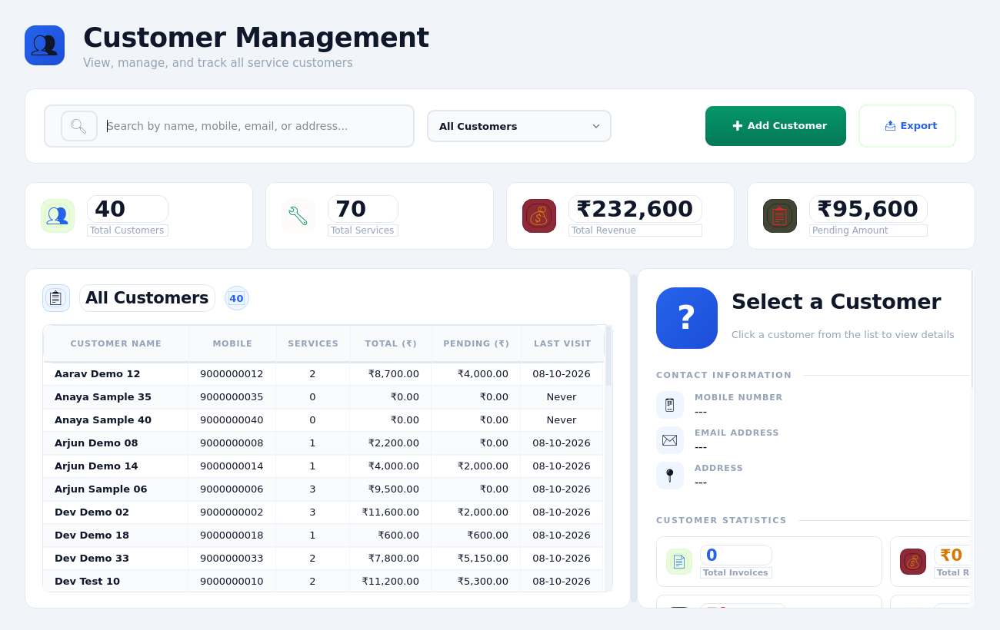

### AMC contracts
Annual maintenance contracts, visit schedules and renewals.

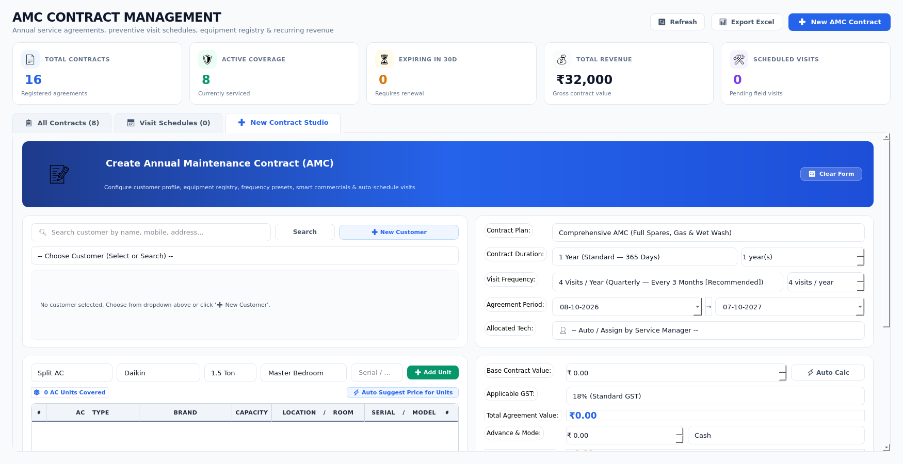

### Daily log
Daily work and cost entries per technician.

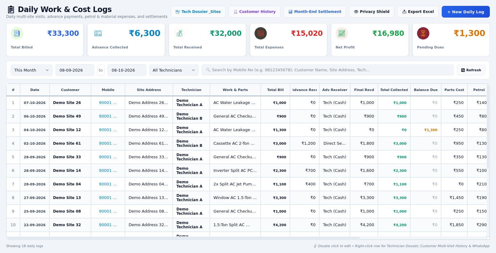

### Settlement
Settle collections and pending balances.

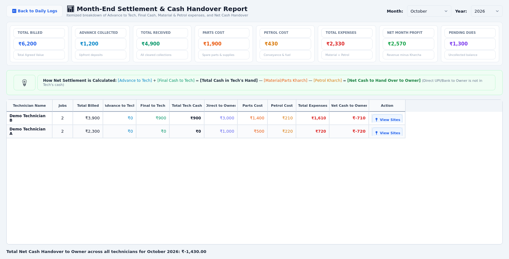

### Technicians
Technician list and workload.

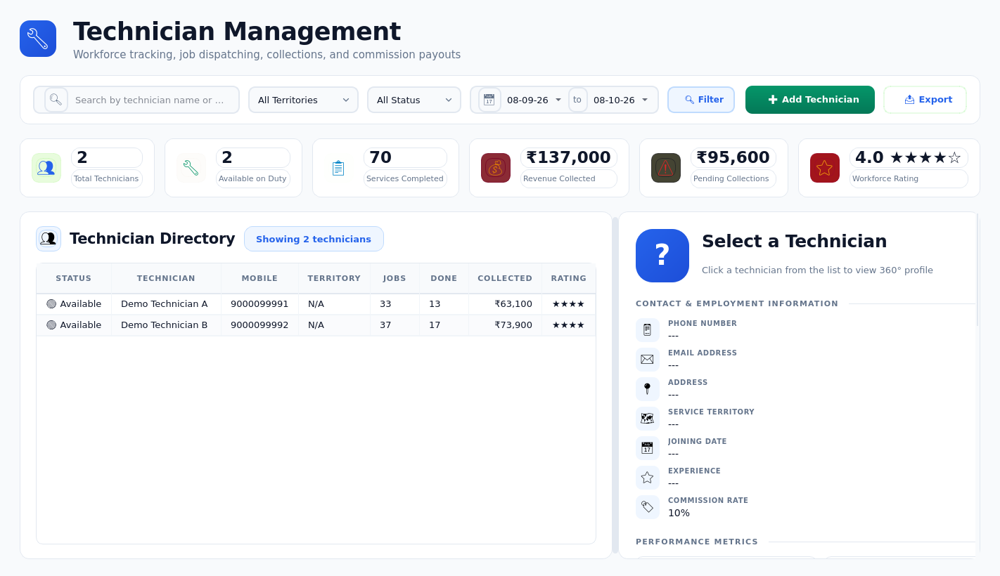

### Inventory
Spare parts stock with low-stock alerts.

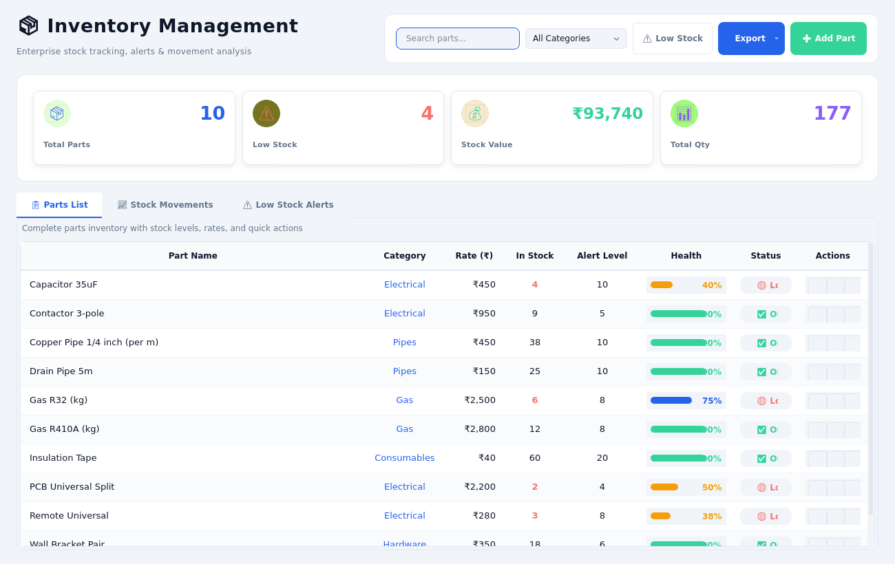

### Reports
Business reports with Excel and PDF export.

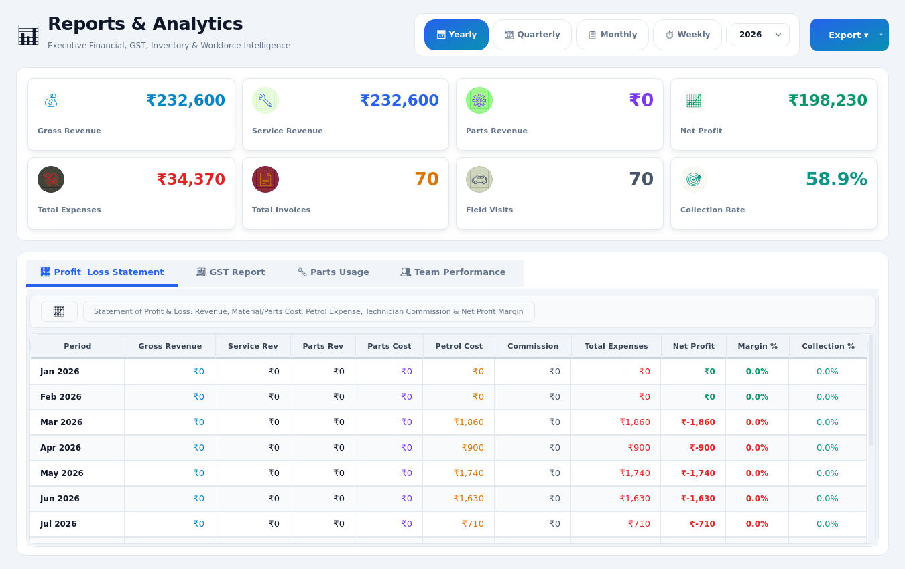

### Settings
Shop details, application options, backup and restore.

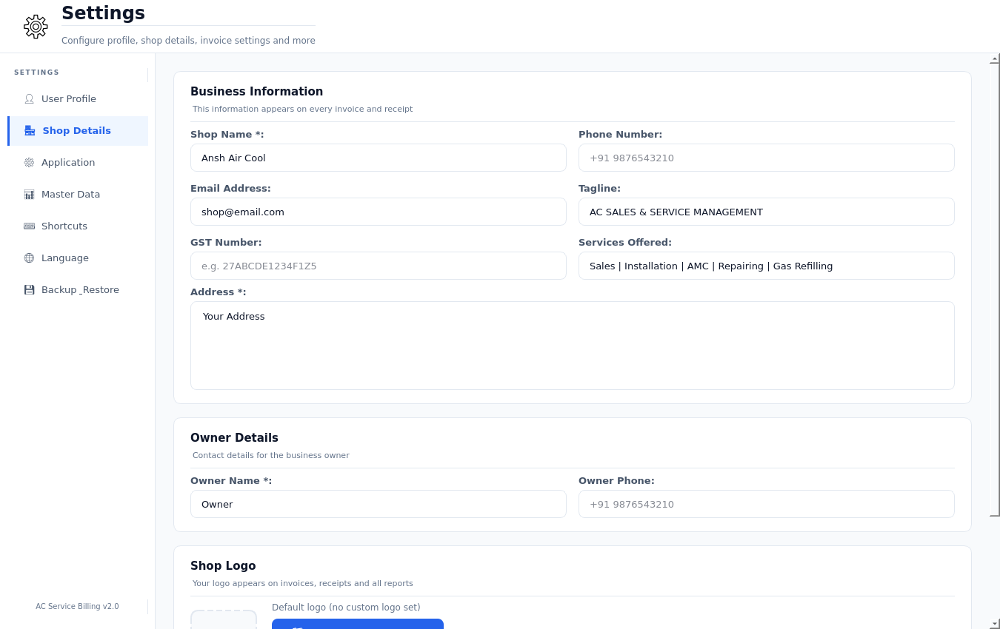

## Tech stack

| Layer | Choice |
|---|---|
| UI | PySide6 (Qt 6), light theme, English and Hindi labels |
| Language | Python 3 |
| Database | SQLite, created automatically in `%APPDATA%\AnshAirCool` |
| PDF and Excel | ReportLab, openpyxl |
| Installer | PyInstaller + Inno Setup |

## Install

### Run from source

```bash
git clone https://github.com/AKASH991833/Desktop_software.git
cd Desktop_software
pip install -r requirements.txt
python main.py
```

No `.env` file or database server is needed. On first run the app creates its database and prints a random one-time admin password to the console.

### Build the Windows installer

Install the dependencies, install [Inno Setup](https://jrsoftware.org/isinfo.php), then run:

```bat
build_exe.bat
```

The executable is written to `dist\AC_Billing_System.exe` and the installer to `installer-output\`. A prebuilt installer is not published in this repository yet.

## Project layout

```
main.py          app entry point
config.py        paths and settings
controllers/     business logic
database/        SQLite schema and queries
views/           PySide6 screens and dialogs
utils/           PDF, Excel, WhatsApp and formatting helpers
docs/            extra documentation
attic/           archived experiments and legacy scripts (not used by the app)
```

## Security notes

- The data stays on the local machine. Nothing is sent to a server by the app itself.
- Login is optional and off by default, because the app is meant for a single owner on one PC. Set the environment variable `AC_LOGIN_ENABLED=1` to require login. Passwords are stored as bcrypt hashes.
- There is no fixed default password. The first admin password is random and shown once.
- Database backup utilities are included.

## License

MIT. See [LICENSE](LICENSE).

## Contact

Akash Vishwakarma - akashvishwakarma1262@gmail.com
